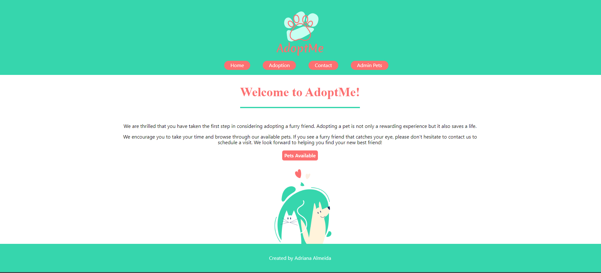

<!-- PROJECT LOGO -->
<br />
<div align="center">
  <h3 align="center">AdoptMe - Capstone Project</h3>

  <p align="center">
    AdoptMe is a user-friendly web application developed as a capstone project for the Software Engineering course at AUT and IOD. The platform enables users to easily browse and adopt pets, providing a seamless interface to view available animals, ask questions, and contact the administrator for adoption or any other queries. With its intuitive design and streamlined functionality, AdoptMe makes pet adoption a hassle-free and enjoyable experience for all animal lovers.
  </p>
</div>


<!-- TABLE OF CONTENTS -->
<details #readme-top>
  <summary>Table of Contents</summary>
  <ol>
    <li>
      <a href="#about-the-project">About The Project</a>
      <ul>
        <li><a href="#built-with">Built With</a></li>
      </ul>
    </li>
    <li>
      <a href="#getting-started">Getting Started</a>
      <ul>
        <li><a href="#prerequisites">Prerequisites</a></li>
        <li><a href="#installation">Installation</a></li>
      </ul>
    </li>
    <li><a href="#roadmap">Roadmap</a></li>
    <li><a href="#contact">Contact</a></li>
    <li><a href="#acknowledgments">Acknowledgments</a></li>
  </ol>
</details>

<!-- ABOUT THE PROJECT -->
## About The Project



This application is a capstone project for a Software Engineering course at AUT with IOD. Its purpose is to help streamline the process of adopting a pet by providing a user-friendly and efficient platform for potential adopters to search for available pets, submit adoption applications, and connect with local shelters or rescue organizations.

<p align="right">(<a href="#readme-top">back to top</a>)</p>

### Built With

* React
* Node.js
* Express.js
* MongoDB Atlas

<p align="right">(<a href="#readme-top">back to top</a>)</p>

<!-- GETTING STARTED -->
## Getting Started
### Installation

1. Clone the repo
   ```sh
   git clone https://github.com/Adriana2710/adoptMe
   ```
3. Install NPM packages
   ```sh
   npm install
   ```
4. Once the dependencies are installed, you can start the project by running:
    ```sh
    npm start
    The project will be available at http://localhost:3000 in your web browser. Front-End.
    ```
5. Once you initialized the project, you run inside the adoptMe/api:
    ```sh
    npm start dev
    
    You should receive this message: Server listenning at http://localhost:3001 / successful connection to the database
    ```


<p align="right">(<a href="#readme-top">back to top</a>)</p>

<!-- ROADMAP -->
## Roadmap

- [1] Home Page
- [2] Adoption Page with all pets available for adoption
- [3] Contact Page to adopt a pet or make any enquirie 
- [4] Admin Pets - Login Page for administrator
    * you can use any email and password, this feature is still in progress
- [5] When logged into a Admin Page you will have:
    * List of pets and options to delete or edit
    * Form to add a new pet to the page Adoption
    
<p align="right">(<a href="#readme-top">back to top</a>)</p>

<!-- CONTACT -->
## Contact

Adriana Silva Almeida - [@Adriana97423137](https://twitter.com/Adriana97423137) - adriana-salmeida@hotmail.com

Project Link: [https://github.com/Adriana2710/adoptMe](https://github.com/Adriana2710/adoptMe)

<p align="right">(<a href="#readme-top">back to top</a>)</p>

<!-- ACKNOWLEDGMENTS -->
## Acknowledgments

Use this space to list resources you find helpful and would like to give credit to. I've included a few of my favorites to kick things off!

* [GitHub Pages](https://pages.github.com)
* [Font Awesome](https://fontawesome.com)
* [React Icons](https://react-icons.github.io/react-icons/search)
* [React Documentation](https://legacy.reactjs.org/docs/getting-started.html)
* [Express.js Documentation](https://expressjs.com/)
* [MongoDB Documentation](https://www.mongodb.com/docs/)


<p align="right">(<a href="#readme-top">back to top</a>)</p>


